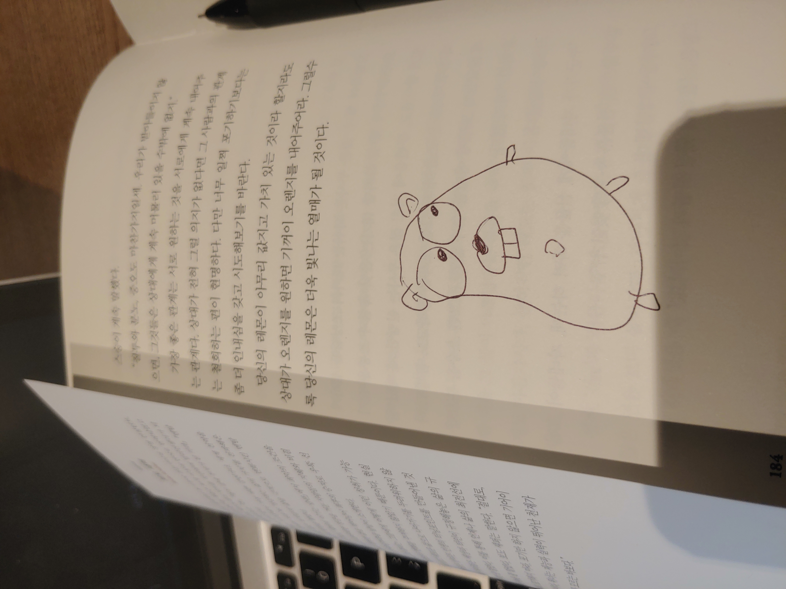
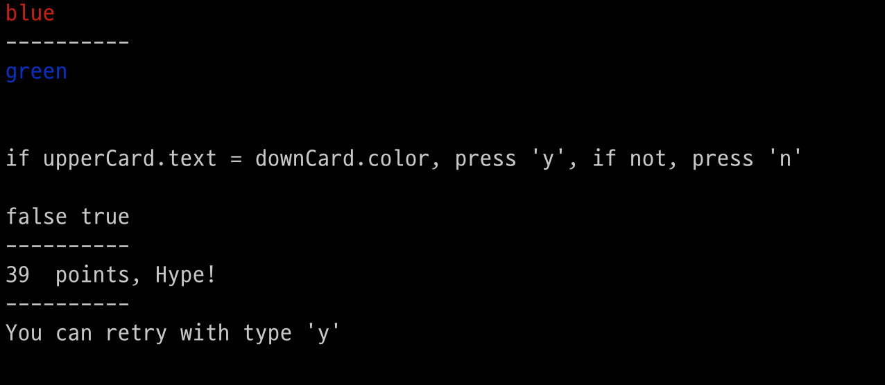

# Shortcut-for-go-lang-learner
I will make a shortcut for someone who wants to reach a level where they can say "I've dealt with the language"


[한국어](README-KO.md)

## Our journey


- Install
- What is ```package main```?
- Variable
- Run a script
- Function
- Loop
- Stdout, Stdin
- Make the simplest cli game.
- Where do I go next

### Install
[Official Install Page](https://go.dev/doc/install)

### What is ```package main```
**Package** keyword is using describe script name and namespace, It can be imported from another package script.  
**Any code written in Go belongs to a package.**  
You can Import another package with ```import "{packageName}"```   
```main``` package has a special function called the ```main``` function. It is the entry point to execute your program. And the main function has zero arguments nor does not return any value.


### Variable  
Go is strongly, statically **typed language**.  
Variables are used by the **compiler**. 

```go
package main

func main() {
  var n int = 3
  const s string = "Power"
  const b bool = false
}

```

### Run a script
You can make a script, how to run this a script?
```bash
go run {filename}
```

### Function
You can declare a function with ```func``` keyword.

```go
package main

import ("math/rand")

func main() {
  const doIDateOnWeekend bool = canIDateOnThisWeekend()
  const doIDateOnThisMonth bool = canIDate(23)
}

func canIDateOnThisWeekend() bool {
  return false
}

func canIDate(luckyNumber int) bool {
  var rullet []bool = {false, false, false, false, false, false, true}
  rand.Seed(luckyNumber)

  return rullet[rand.Intn(len(rullet) - 1)]
}
```

### Loop
Go has only one looping construct, the ```for``` loop.

```go
package main

func main() {
	var sum int = 0
	for var i = 0; i < 10; i++ {
		sum += i
	}
}
```
### Stdout, Stdin
Go has a built-in library called ```standard library```.  
It has a bunch of extended function for language. We use ```fmt package``` for Stdin, Stdout, this package implements formatted I/O with functions is analogous to C's printf and scanf.

```go
package main

import (
  "fmt"
)

func main() {
  var i interface{} = 23
  fmt.Printf("%v\n", i)
}
```


### Make the simplest cli game.
Think for 5 minutes and think of the simplest game in the world.  
And describe, make rule, coding.  
  
I will make text-color game.  
It offer 2 cards with colored text.  
You can get meaning of text on left card, otherwise right, you should get only color not meaning of text.  
  
You can play with ```go run main.go```.



### Where do I go next


